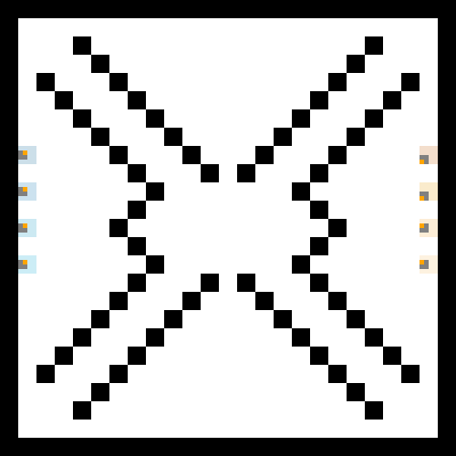

# Paint Wars - IA multi-agents

Variation compétitive du **problème de la patrouille multi-agents** : deux équipes de 4 robots s'affrontent pour conquérir un maximum de territoire dans des arènes variées.

Contrainte principale : chaque robot n'a accès qu'à ses **8 capteurs de distance** et dispose d'**un seul entier** en mémoire. Pas de communication, pas de carte, pas d'information globale.

Projet réalisé dans le cadre de l'UE LU3IN025 (IA & Jeux, Sorbonne Université).

## Aperçu

| Arena ouverte | Arena couloirs | Arena X |
|---|---|---|
|  |  |  |

Bleu = notre bot, Rouge = adversaire de référence.

## Approche

### Comportements Braitenberg

5 comportements réactifs purs (pas de structure conditionnelle) : la sortie moteur est une somme pondérée des activations sensorielles. Implémentations : évitement d'obstacles, attraction/répulsion des murs, attraction/répulsion des robots.

### Architecture de subsomption

Couche de priorités entre comportements : évitement de murs > poursuite de robots > exploration. Permet de combiner des comportements simples en un comportement global cohérent.

### Optimisation par algorithme génétique

Recherche des poids optimaux d'un perceptron de contrôle (8 paramètres) via un (1+1)-ES :
- Mutation d'un seul paramètre par génération
- Sélection élitiste : remplacement seulement si le fils fait mieux ou égal
- Évaluation moyennée sur 3 essais (orientations aléatoires) pour limiter le bruit
- Comparaison empirique avec une baseline de recherche aléatoire

### Stratégie finale

4 robots spécialisés avec une architecture hybride :

| Robot | Rôle | Stratégie |
|-------|------|-----------|
| 0 | Explorateur | Braitenberg + biais aléatoire pour maximiser la couverture |
| 1 | Chasseur de couloirs | Détection de passages étroits, accélération en ligne droite |
| 2 | Infiltrateur | Navigation asymétrique avec oscillation sinusoïdale |
| 3 | Sweeper | Comportement hand-tuned + perceptron optimisé par AG |

Mécanismes partagés entre les 4 robots :
- **Bit-packing** : 5 variables (position précédente, état, compteur de blocage, compteur de pas) encodées dans un seul entier via des masques et shifts binaires
- **Détection de blocage** : rotation d'échappement si le robot est immobile pendant 10 pas consécutifs
- **Répulsion entre alliés** : force répulsive proportionnelle à la distance pour diversifier l'exploration
- **Poursuite d'adversaires** : réorientation vers l'ennemi le plus proche quand il est détecté

## Structure du projet

```
├── src/
│   ├── robot_challenger.py           # stratégie finale
│   ├── tetracomposibot.py           # moteur de simulation (fourni)
│   ├── robot.py                      # classe de base Robot (fourni)
│   ├── robot_champion.py             # adversaire de référence (fourni)
│   ├── arenas.py / arenas_eval.py    # arènes de jeu
│   ├── config*.py                    # fichiers de configuration
│   ├── behaviors/                    # comportements réactifs
│   │   ├── robot_braitenberg_*.py    # 5 comportements Braitenberg
│   │   └── robot_subsomption.py      # architecture de subsomption
│   └── optimization/                 # algorithmes d'optimisation
│       ├── genetic_algorithms.py     # algo génétique (1+1)-ES
│       ├── robot_randomsearch.py     # recherche aléatoire
│       └── robot_randomsearch2.py    # recherche aléatoire améliorée
├── scripts/
│   ├── go_tournament                 # tournoi sur 5 arènes
│   └── go_tournament_eval            # tournoi complet sur 10 arènes
├── utils/
│   ├── plot_resultats.py             # visualisation des résultats
│   └── record_gif.py                 # enregistrement de GIFs
└── assets/                           # GIFs de demo
```

## Lancer le projet

```bash
pip install -r requirements.txt

# Un match
cd src
python tetracomposibot.py config_Paintwars

# Avec paramètres : arène (0-4), position (True/False), vitesse (0=normal, 1=rapide, 2=sans affichage)
python tetracomposibot.py config_Paintwars 1 False 1

# Tournoi complet (depuis la racine du projet)
sh scripts/go_tournament
```
