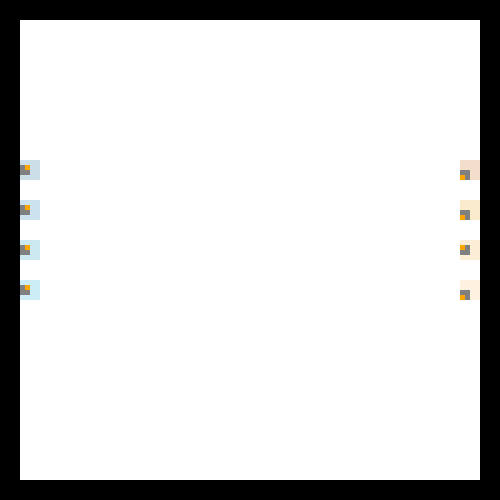
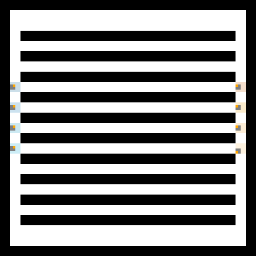
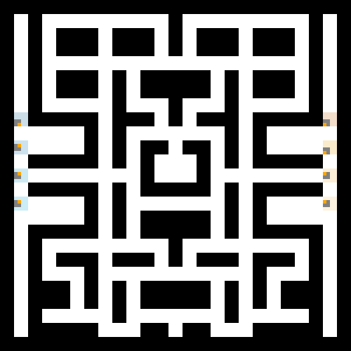

# Paint Wars 

Projet de L3 Informatique, UE IA & Jeux

Le but : programmer une equipe de 4 robots autonomes qui doivent conquerir le plus de cases possible dans une arene, face a une equipe adverse. Les robots n'ont que leurs capteurs (distance aux obstacles, type, equipe) et **un seul entier** en memoire. Pas de communication entre eux, pas de carte.

## Demo

| Arena 0 (ouverte) | Arena 2 (couloirs) | Arena 4 (labyrinthe) |
|---|---|---|
|  |  |  |

Rouge = equipe OMEGA, Bleu = adversaire. Les cases colorees montrent le territoire conquis.

## Approche

### Comportements Braitenberg

5 comportements reactifs ou la rotation et la translation dependent directement des capteurs, sans if/else :
- Evitement d'obstacles, attraction/repulsion des murs, attraction/repulsion des robots

### Architecture de subsomption

Combinaison de comportements avec priorites : eviter les murs > aller vers les robots > avancer tout droit.

### Algorithme genetique

Optimisation des poids d'un perceptron (8 params) avec un (1+1)-ES :
- Mutation d'un seul param par generation
- Selection : l'enfant remplace le parent que s'il est meilleur ou egal
- Chaque strategie est evaluee 3 fois pour eviter le bruit
- J'ai aussi implemente une recherche aleatoire pour comparer

### Strategie finale (equipe OMEGA)

4 robots avec des roles differents :

| Robot | Role | Description |
|-------|------|-------------|
| 0 | Explorateur | Braitenberg avec un peu d'aleatoire pour bien couvrir |
| 1 | Chasseur de couloirs | Detecte les couloirs et fonce tout droit dedans |
| 2 | Infiltrateur | Navigation asymetrique avec oscillation sinusoidale |
| 3 | Sweeper | Hand-tuned + perceptron optimise par l'algo genetique |

Tous les robots partagent :
- Du **bit-packing** pour stocker 5 infos dans un seul entier (position precedente, etat, compteur de blocage, pas)
- Une **detection de blocage** : si le robot bouge plus pendant 10 pas, il tourne pour se debloquer
- Une **repulsion entre allies** pour pas explorer les memes zones
- Une **poursuite des adversaires** quand ils sont detectes

## Structure du projet

```
├── src/
│   ├── tetracomposibot.py           # moteur de simulation (fourni)
│   ├── robot.py                      # classe de base Robot (fourni)
│   ├── robot_challenger.py           # strategie finale
│   ├── robot_champion.py             # adversaire de reference (fourni)
│   ├── arenas.py / arenas_eval.py    # arenes de jeu
│   ├── config*.py                    # fichiers de configuration
│   ├── behaviors/                    # comportements reactifs
│   │   ├── robot_braitenberg_*.py    # 5 comportements Braitenberg
│   │   └── robot_subsomption.py      # architecture de subsomption
│   └── optimization/                 # algorithmes d'optimisation
│       ├── genetic_algorithms.py     # algo genetique (1+1)-ES
│       ├── robot_randomsearch.py     # recherche aleatoire
│       └── robot_randomsearch2.py    # recherche aleatoire amelioree
├── scripts/
│   ├── go_tournament                 # tournoi sur 5 arenes
│   └── go_tournament_eval            # tournoi complet sur 10 arenes
├── utils/
│   ├── plot_resultats.py             # visualisation des resultats
│   └── record_gif.py                 # enregistrement de GIFs
└── assets/                           # GIFs de demo
```

## Lancer le projet

```bash
pip install -r requirements.txt

# Un match
cd src
python tetracomposibot.py config_Paintwars

# Avec parametres : arene (0-4), position (True/False), vitesse (0=normal, 1=rapide, 2=sans affichage)
python tetracomposibot.py config_Paintwars 1 False 1

# Tournoi complet (depuis la racine du projet)
sh scripts/go_tournament
```
